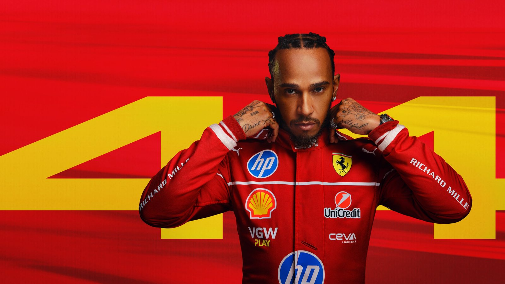
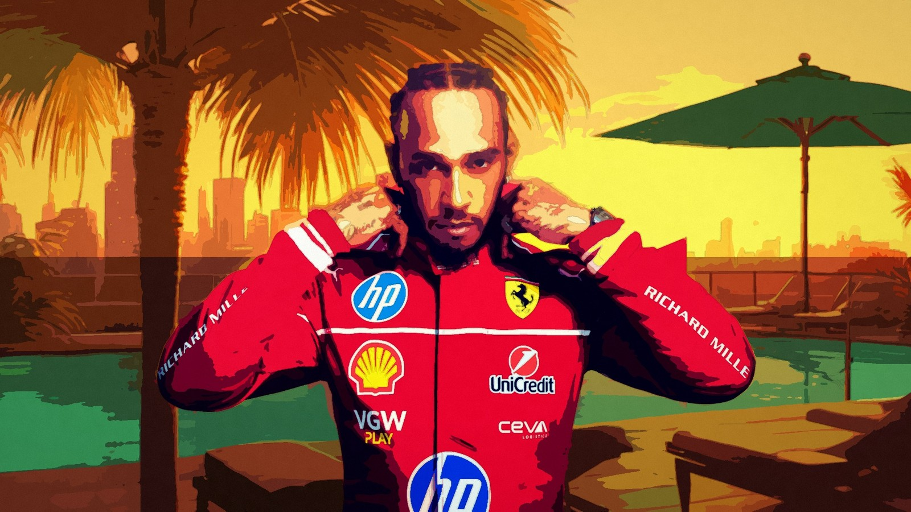
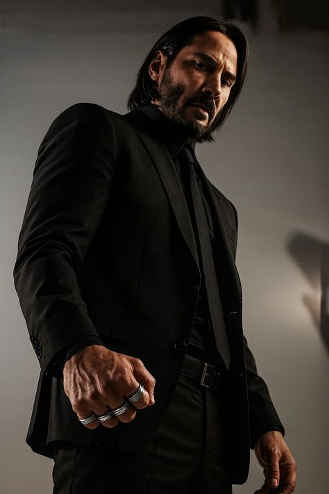
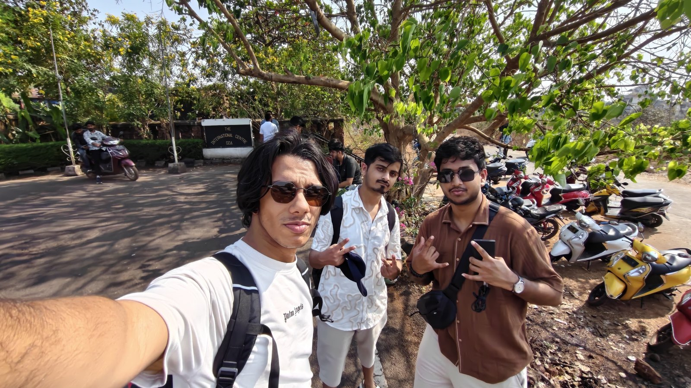
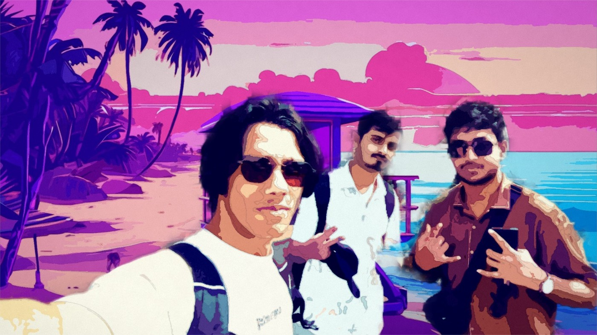
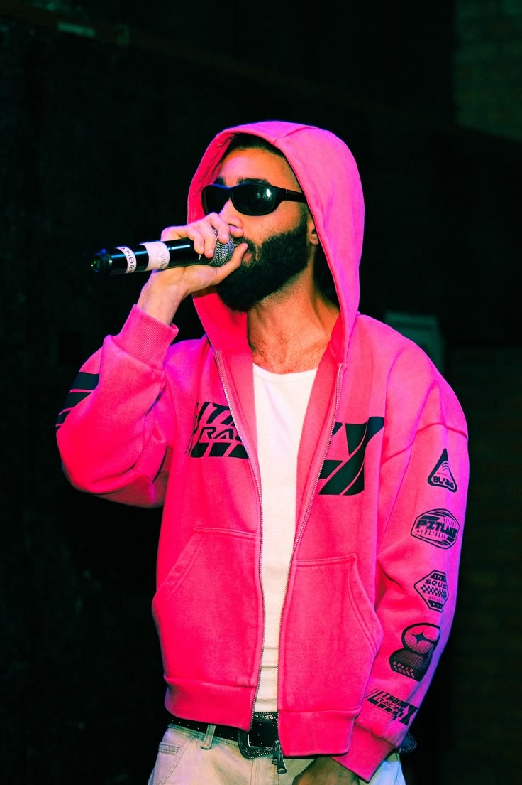

# bahía rosa

**the city prints you. then your poster takes the city.**

one photo in, a painted character portrait out — entirely in the browser. no upload, no account, no api key, no
server in the request path: the segmentation model, the palette, the compositor and the editor all run on the
visitor's machine, and the photograph never leaves the page.

**live: [bahia.langersword.in](https://bahia.langersword.in/)** — if you like it, a ⭐ helps the next person
find it.

built for unlayer's *build with react image editor* challenge, where `@unlayer/react-image-editor` is the
workstation rather than a dependency of convenience.

## the gta vi experience

Bahía Rosa is a city that prints you. You drop one photograph; the app cuts you out of it in the browser, reads
the light in the frame, grades you into dusk, golden hour or neon, and sets you on a plate of the city — and
then the city's own media machine wants that face: the loading screen, the front page, the billboard, the
postcard. The React Image Editor is the workstation the whole thing runs on — the full tool rail, live on every
surface, with the city's own typefaces loaded into it. Nothing uploads and nothing is fetched from a server:
segmentation, grading and printing all happen locally, so the photo never leaves the machine it was opened on.

## how it works

```
photo → cut ──────► paint ──────► place ──────────► arrange ──► editor ──► city
        MediaPipe   Oklab        a scene plate or    drag,       Unlayer    billboard · venue
        in-browser  palette,     the visitor's own   size,       gated      feed · postcard
        soft alpha  ink, grain   room, graded        crop        per surface + the frame alone
```

four decisions carry it:

- **light is read before colour.** a tungsten room and shade both lie about white, so the cast is pulled
  neutral first, then a dim frame is lifted by its own histogram. measured: a tungsten room's colour error
  drops 79% (`docs/lighting.txt`).
- **the cut is a soft mask**, eroded two pixels — the model's boundary pixels are a person/background blend,
  which is exactly the pale halo. a group is **one layer** on purpose: splitting it would break the redraw.
- **colour work is Oklab, never RGB.** the palette spends its colours where the eye can see the difference:
  20 colours land within ΔE 0.05 on 97%+ of pixels, 32 on 99.9% (`docs/accuracy.txt`).
- **a preview is the exporter.** the canvas on screen and the file you download run the same `drawPlacement()`,
  so a download is the preview at full resolution, not a second rendering of it.

three finishes, one press:

| | fast | fine | as it is |
|---|---|---|---|
| frame | 1280×720 | 1900×1080 | your photograph's own shape |
| palette | 20 colours | 32 colours | 40 colours |
| detail pass | on (0.92) | off | off |
| warm press | ~10s | slower by design | slower by design |

the same six-class finder for all three — speed comes from palette rounds, edge passes and frame size, never
from the quality of the cut. everything runs on a phone too, at 390×844, with real touch handling and no
sideways scroll.

## gallery

**in** is the photograph as it arrived, **out** is the plate the press made of it — every frame a download
from the app.

| in | out |
|---|---|
|  |  |
|  |  |
|  |  |
|  |  |

top to bottom: a race suit on the flat red ground it was shot against, printed at the pool — every sponsor
mark survives the palette. a suit against a dark room, printed into the marina: the subject was *placed* in
the scene, so the marina is nobody's room. four people mid-selfie, printed as **one person-shaped layer**,
because splitting a group breaks the continuity of the redraw — [@spirizeon](https://github.com/spirizeon) and
[@arpan-pramanik](https://github.com/arpan-pramanik) were in that frame. i had fun building this project. and a portrait, 736×1104, printed onto the neon street at 1600×900 —
the two are different shapes because that is the product: the press composes into its own frame.

`node tools/paint-photo.mjs <photo>` makes your own, at every finish. provenance of every photograph in this
repository: [docs/samples/CREDITS.md](docs/samples/CREDITS.md).

## run it

```bash
npm install --include=dev   # see the note below
npm run dev                 # vite, on :5178 (strictPort)
npm run test                # vitest; rewrites docs/accuracy.txt and docs/lighting.txt
npm run test:e2e            # playwright — a real browser and the real press; give it memory
npm run build               # tsc --noEmit, then vite build
```

if your shell runs `NODE_ENV=production`, any `npm install` — even with `-D` — prunes the dev dependencies
this repo needs to build and test. that is why the command above says `--include=dev`.

`public/models/` and `public/mediapipe/` (~28MB) are self-hosted so nothing is fetched from a CDN, and the
first press pays for loading them; the browser caches them afterwards. deployment is github pages,
`.github/workflows/pages.yml`, on pushes to `main` only.

## stack

| | |
|---|---|
| app | react 19 · typescript · vite 8 · tailwind 4 · motion · three (hero canvas only) |
| cut | `@mediapipe/tasks-vision` 1.0 — six-class selfie segmentation, in the browser |
| editor | `@unlayer/react-image-editor` 1.0 — a different tool set per surface, so the editor is core structurally rather than by claim |
| tests | vitest (unit, 199) · playwright (e2e, 55 including a real-touch phone walk) |

the source is small and boringly laid out: `src/look/` is the press (segmentation, palette, compositor, the
hour), `src/world/` is the frame geometry and the city surfaces, `src/components/` is what a visitor touches,
`src/lib/` is the stores. `tools/` holds the measurement scripts — `press-time.mjs` prints where the seconds
go, `paint-time.ts` what each paint lever costs, `plate-shot.mjs` presses one photograph and keeps it.

## credits

the photographs in the gallery and the samples are credited, with their provenance, in
[docs/samples/CREDITS.md](docs/samples/CREDITS.md) — including the ones that are other people's, shipped as
the *before* halves with nothing claimed for them. the welcome bed is Kevin MacLeod's "Latin Industries"
(CC BY 4.0).

unofficial, fan-made, not affiliated with or endorsed by rockstar games or take-two interactive. the city
(bahía rosa) and its newspaper (la gaviota) are invented; all visuals are original work. licence:
[MIT](LICENSE).

if this was worth your five minutes, a ⭐ on the repository is the whole ask — it is the only thing that makes
a project like this visible to anyone else.
