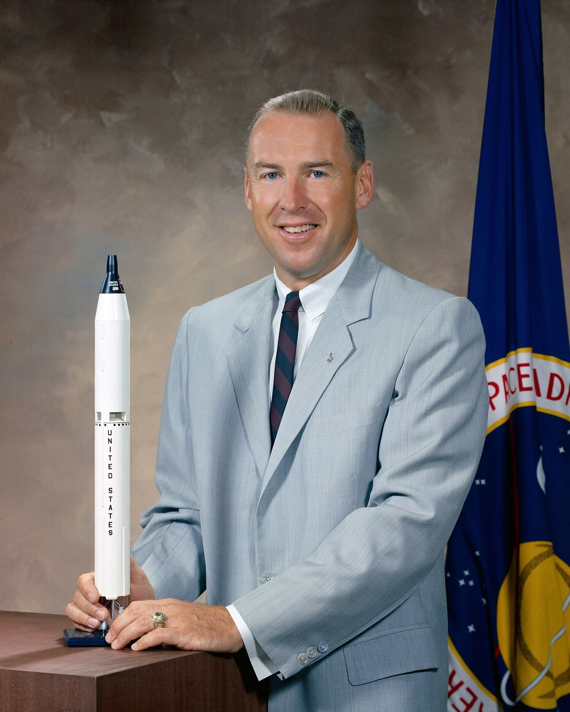
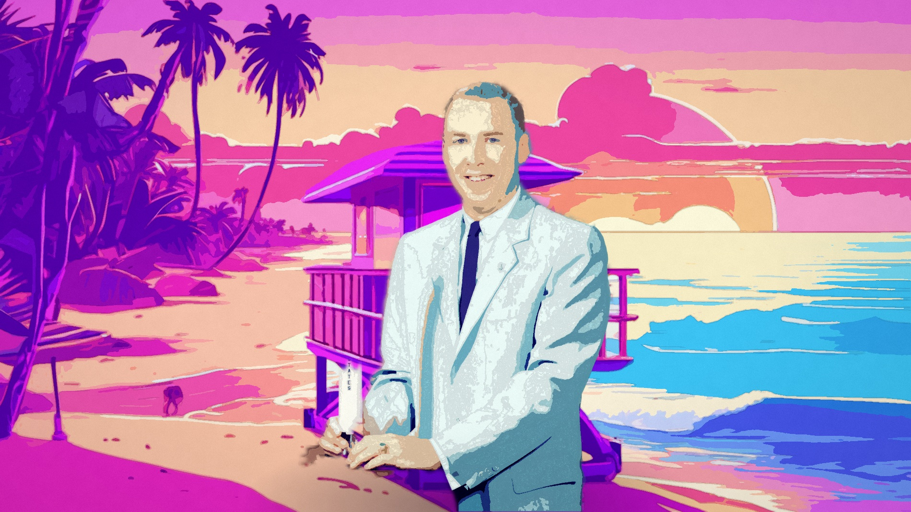
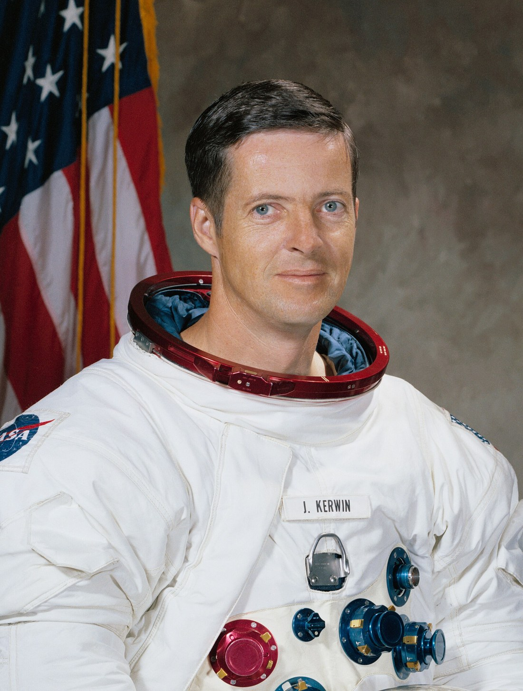
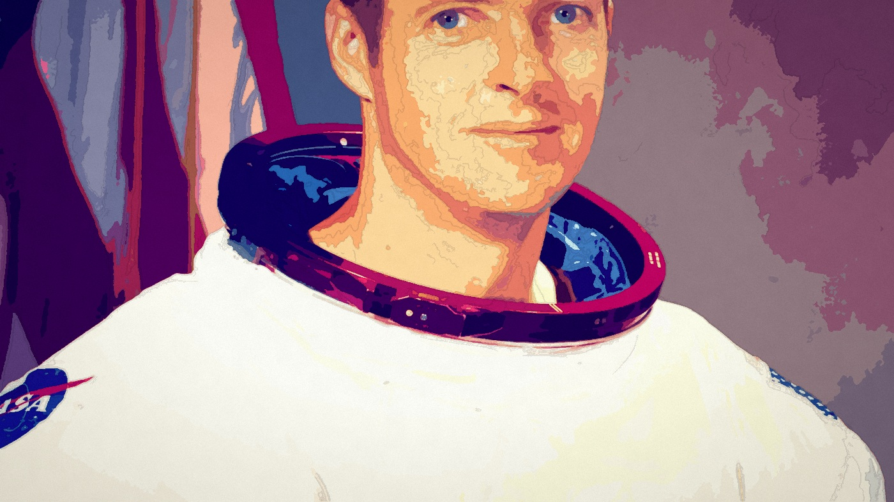
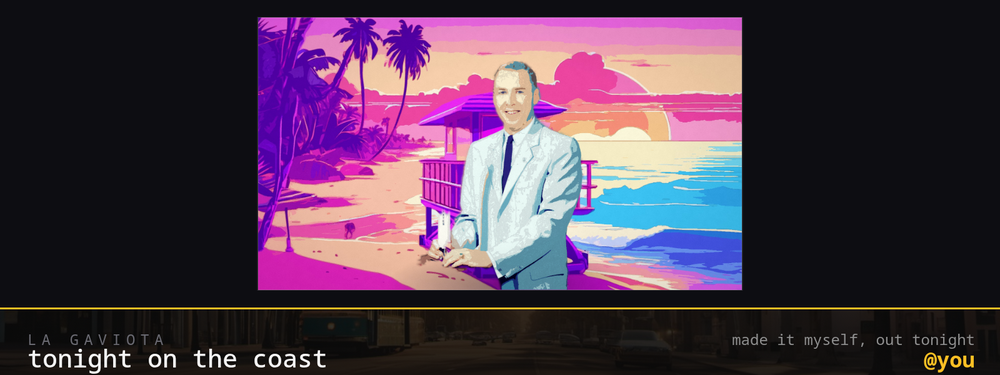
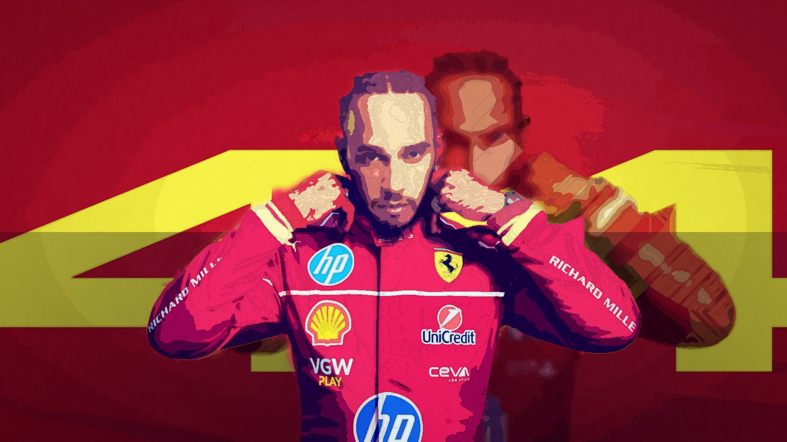
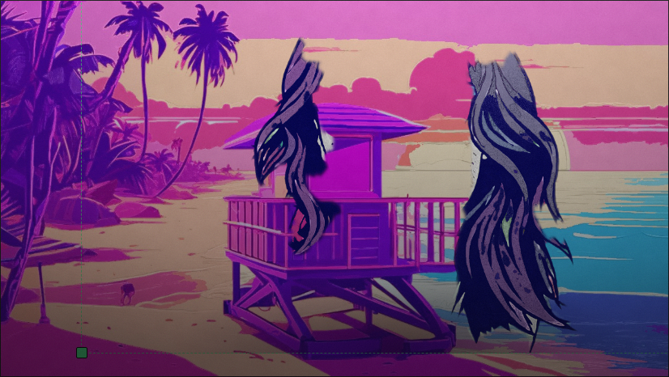

# BAHÍA ROSA

**The city prints you. Then your poster takes the city.**

A GTA VI-inspired experience built for the
[Unlayer "Build with React Image Editor" Challenge](https://github.com/unlayer/react-image-editor).

You bring one photo. It does not leave your browser: a segmentation model finds you **in the frame**
(MediaPipe, self-hosted — no key, no account, no upload), the press paints you in the city's light and sets
you in a place — a Bahía beach at golden hour, the marina, a rooftop pool, a palm boulevard, or simply your
own room, redrawn as it is. Then the fork: **keep the frame**, or take it **into the editor** and make
tonight's poster. And then the payoff: **the city runs it** — roadside billboard, venue foyer, the coast's
feed, a printed postcard — each at full resolution, plus the frame on its own with nothing around it.

Nothing is uploaded, there is no account and no API key. Every pixel is drawn in your browser.

## What it makes

These are **real photographs** pressed by the real product — no mock-ups. The two NASA portraits are public
domain; `docs/samples/CREDITS.md` says where every file came from and why.

| | |
|---|---|
|  |  |
| **in** — NASA's 1964 portrait of astronaut Jim Lovell | **out** — the press's frame, fine finish: cut, painted, placed, in one pass in the browser |
|  |  |
| **in** — NASA's portrait of astronaut Joseph Kerwin | **out** — *as it is*: the whole photograph repainted and graded, no cut, no layers |



*The city runs it* — the roadside billboard, 1600×600, out of the same arrangement. The venue foyer, the
coast's feed and the printed postcard are the same frame at their own sizes.

| | |
|---|---|
|  |  |
| **the lettering survives** — the paint over a press photograph of Lewis Hamilton: the sponsor marks and his number come through the palette | **the arrangement** — the person's own box in the frame, with corners that size them and cut lines that crop |

`node tools/sample-set.mjs <url>` re-makes a set from the fixtures that ship with the repo;
`node tools/real-samples.mjs <url> <outDir> <photo> <name> [fine|fast|asit] [city]` does it for any
photograph you point it at, which is how the four above were made.

## The pipeline

```
photo → cut ──────────► paint ──────► place ──────────────► FORK ─────────► editor ──────► city
        (MediaPipe      (Oklab       (a scene plate or      raw │ edited     (React Image   billboard · venue
         segmenter,      palette,     the visitor's own     │   │            Editor)        feed · postcard
         in-browser)     ink, grain)  room, graded)         │   └─ flatten ──►            + the frame alone
                                                            └─ arrange the subject, in the frame, in the editing phase
```

The rules the press keeps, each one written down because it was learned the hard way:

- **The photograph decides the light, before anything else looks at colour.** A tungsten room and a street in
  shade both lie about colour; the cast is pulled back toward neutral first, and a dim frame is lifted by its
  own histogram rather than by a constant. Measured: a tungsten room's colour error drops 79%.
- **The cut keeps everybody above a noise floor** and, when the model's answer swallows the frame (which is
  what an illustration does to it), the *confidences* are re-read strictly before the press gives up.
- **Colour work happens in Oklab**, not RGB — a perceptual space, so the palette spends its colours where the
  eye can see the difference. Measured on a photograph-like frame: 12 colours land within ΔE 0.05 on **96.7%**
  of pixels, 32 on 99.9%.
- **The frame is two layers**: the place with nobody in it, and the person, painted, on nothing. That is what
  lets the person be moved over their own background instead of the whole picture sliding — and it is why the
  ground must never contain a second copy of them.
- **A preview is the exporter.** The canvas on screen and the file you download call the same
  `drawPlacement()`, so a download *is* the preview at full resolution, not a second rendering of it.
- **Everything is measured, or it is not claimed.** `docs/accuracy.txt` and `docs/lighting.txt` are written by
  the test suite on every run, and the numbers in this README come from them.

## The finishes

| | fast | fine | as it is |
|---|---|---|---|
| frame | 1280×720 | 1900×1080 | 1400×788 |
| palette | 16 colours, 8 rounds | 32 colours, 8 rounds | 40 colours, 5 rounds |
| edge | one pass | three passes | — (no cut) |
| finder | six-class segmenter | six-class segmenter | none |
| warm press | **≈12s** | ≈20s | **≈8s** |

The report line under the frame prints the finish *and* the width, because those are the two things that
change what you get.

## Run it

```bash
npm install
npm run dev          # the app, on :5178
npm run test         # unit tests; rewrites docs/accuracy.txt and docs/lighting.txt
npx playwright test  # the suite, in a real browser — it needs memory to spare
node tools/sample-set.mjs http://localhost:5178   # re-make the pictures above
```

**The optional print desk.** A local GPU renderer (`tools/desk/desk.sh`, ComfyUI + FLUX.2 [klein]) that can
print a plate in a minute instead of in a browser. It is *not* required: the deployed app prints entirely in
the page. Point the app at one with `?desk=<url>` and it is remembered — see
[`docs/print-desk.md`](docs/print-desk.md) for costs, quota and the self-stop watchdog.

## The editor

The arrangement has a **crop button**. Pressing it turns the frame into a crop: the cut lines sit on the
person where the cut will land, any of the four drags straight to where you want it, and the same four
numbers are on sliders for anyone who would rather type — because "I don't want the full body in this one" is a
decision about the picture, not a percentage. The lines are drawn on the *uncropped* extent, which is the
part that is otherwise invisible: the cut is applied before the fit, so what is drawn is the cropped
person, and the only honest way to show what a cut takes away is to draw the box it is taking it from.

React Image Editor (`@unlayer/react-image-editor`) is the workstation. Each surface hands it a different tool
set (`features.imageEditor.tools`), so "the editor is core" is structural rather than a claim — and the
arrangement lives in the same phase, in the frame above the tools: drag the subject, drag a corner to size
them, cut from the top or bottom, let them run off the edge. The frame is drawn from the same geometry the
exporter uses, so the box in the outline is the box you get.

The editor's own chrome is theirs, including **Flatten layers**, which stays disabled until there is more than
one layer to flatten (add text, a sticker or a shape and it enables). The tool rail has no layers tool; the
measurement is in [`docs/editor-contract.md`](docs/editor-contract.md).

## On a phone

The whole flow works on a phone: choose a place, press, compare, arrange, crop, download — no sideways
scroll at any stage, and the drag surfaces sized for a fingertip rather than a cursor (the handles grow
under a coarse pointer, and the frame and its cut lines carry `touch-action: none`, so a press-and-drag is
a drag and not a scroll). `tests/e2e/mobile.spec.ts` walks 390×844 with **real touch events** and asserts
all three.

The one deliberate exception is Unlayer's editor, a 1024×700 desktop surface by contract
(`docs/editor-contract.md`): on a phone it keeps that size inside a scroller of its own rather than pushing
the page — and the arrangement above it — sideways.

## Design

The chrome is measured from the studio's own site rather than guessed at, and the contract every component
answers to is [`DESIGN.md`](DESIGN.md) — tokens, type roles, and the rules about what may be a gradient, a
panel or a kicker (the short version: none of the last three unless it has a job).

---

Unofficial fan-made project for the Unlayer Build with React Image Editor Challenge. Not affiliated with,
endorsed by, or connected to Rockstar Games or Take-Two Interactive. All visuals are original work; the city
(Bahía Rosa) and its newspaper (LA GAVIOTA) are invented.