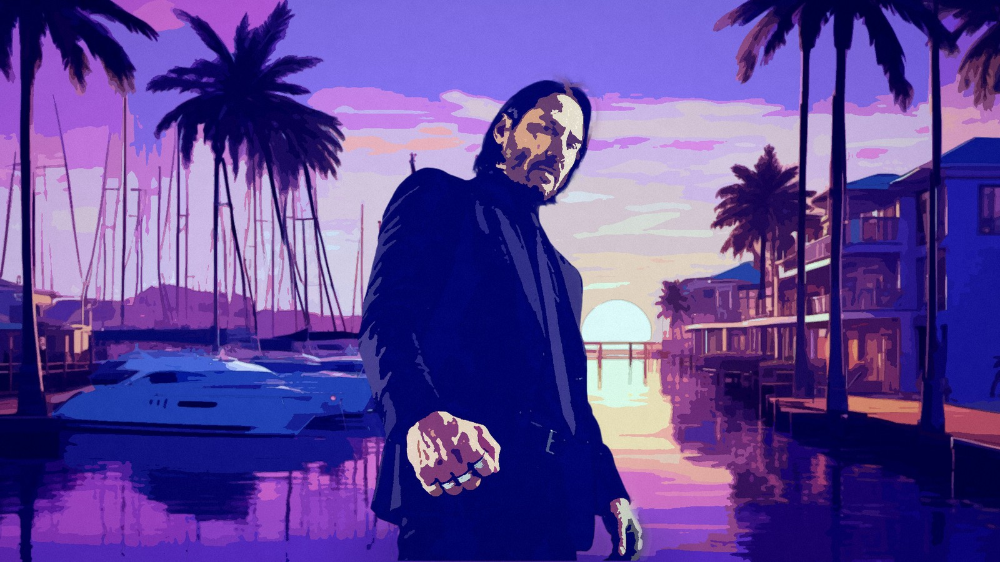
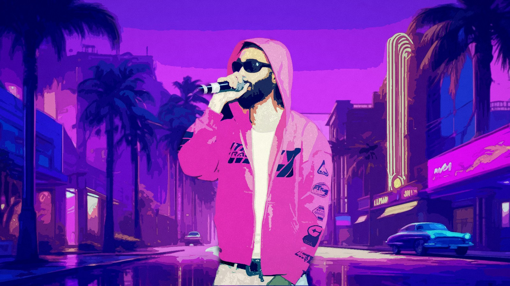

# bahía rosa

**the city prints you. then your poster takes the city.**

one photo in, a painted character portrait out — entirely in the browser. no upload, no account, no api key,
no server in the request path: the segmentation model, the palette, the compositor and the editor all run on
the visitor's machine, and the photograph never leaves the page.

built for unlayer's *build with react image editor* challenge, where `@unlayer/react-image-editor` is the
workstation rather than a dependency of convenience.

live: **https://bahia.langersword.in/**

## gallery


*Lewis Hamilton, pressed and set at the pool. Every sponsor mark on the suit survives the palette — hp,
Shell, UniCredit, CEVA, Richard Mille — which is the whole reason the detail pass exists.*


*a group on the beach plate. A group is **one layer**: it moves, sizes and crops together, because splitting
it would break the continuity of the redraw.*



*the marina at golden hour — a subject the press placed in the scene, not one photographed in it.*

### one photograph, and what the press does with it

| in | out |
|---|---|
|  |  |
| **in** — the photograph as it arrived: a portrait, 736×1104, stage light already pink | **out** — the frame the press made of it: cut, painted in the hour's light, placed on the neon street, 1600×900 |

*every one of these is a download from the app.* `node tools/paint-photo.mjs <photo>` makes your own, and
[docs/samples/CREDITS.md](docs/samples/CREDITS.md) records where each photograph in this repository came from.

## stack

| | |
|---|---|
| app | react 19 · typescript · vite 8 · tailwind 4 · motion · three (hero canvas only) |
| cut | `@mediapipe/tasks-vision` 1.0 — six-class selfie segmentation, models served from our own origin |
| editor | `@unlayer/react-image-editor` 1.0 — tool sets gated per surface |
| tests | vitest (unit, 199) · playwright (e2e, 53 including a real-touch phone walk) |

## the pipeline

```
photo → cut ──────────► paint ──────► place ──────────────► FORK ─────────► editor ──────► city
        (MediaPipe      (Oklab       (a scene plate or      raw │ edited     (React Image   billboard · venue
         segmenter,      palette,     the visitor's own     │   │            Editor)        feed · postcard
         in-browser)     ink, grain)  room, graded)         │   └─ flatten ──►            + the frame alone
                                                            └─ arrange the subject, in the frame, in the editing phase
```

the invariants, each learned the hard way and each one asserted somewhere in `tests/`:

- **light is decided before anything looks at colour.** a tungsten room and shade both lie about white; the
  cast is pulled toward neutral against the brightest tenth, then a dim frame is lifted by its own histogram
  rather than a constant. measured: a tungsten room's colour error drops 79% (`docs/lighting.txt`).
- **everybody above the noise floor survives the cut** — including a group — and when the model's answer
  swallows the frame (an illustration does this to a photo-trained model), the *confidences* are re-read
  strictly before the press gives up and paints flat.
- **colour work is Oklab, never RGB.** the palette spends its colours where the eye can see the difference.
  measured on a photograph-like frame: 20 colours land within ΔE 0.05 on 97%+ of pixels, 32 on 99.9%
  (`docs/accuracy.txt`).
- **the frame is two layers**: the place with nobody in it, and the person painted on nothing. that is what
  makes a drag move the person instead of the picture, and why the ground must never hold a second copy of
  them.
- **a preview is the exporter.** the canvas on screen and the file you download run the same
  `drawPlacement()`, so a download is the preview at full resolution, not a second rendering of it.
- **the cut is applied to the source, before the fit** — and it is enforced with a floor, because two
  maximum cuts on one axis would otherwise leave a source rect with no extent: a crash inside the painter,
  not a crop (`tests/unit/crop.test.ts`).

## layout

```
src/look/         the press itself
  bodysegment.ts    MediaPipe segmentation → soft alpha, edge refinement, group handling
  stylise.ts        the paint: Oklab palette, ink, grain, the detail pass, all pure functions
  portrait.ts       the compositor: cut, paint, place, the two layers, the final grade
  timeofday.ts      the hour: how a plate is graded for dusk / night / neon
  scenes.ts         the plates, and where a person lands in each

src/world/        the printed world
  compose.ts        layerGeometry / drawPlacement — the one geometry preview and export share
  placements.ts     billboard · venue · feed · postcard, and the arrange FRAME

src/components/   the surfaces a visitor touches
  Arrange.tsx       the arrangement, its outline, and the crop mode
  EditorSurface.tsx Unlayer's editor, tool sets gated per surface
  PlacementCanvas.tsx   a live preview that is the exporter
  PhotoDrop.tsx     drop / paste anywhere, with a hold-and-ask before replacing work
  Entry.tsx         the way in: the title sheet, and what it warms while it is up
  CardReveal.tsx    the card that turns over when the press finishes, and hands over the art
  PressTips.tsx     one true sentence at a time, while the press runs
  VapourText.tsx    the wordmark leaving as dust: the type sampled to particles, blown away
  Toasts.tsx        the site talking back: ink panels, one gold mark, dismissible
  Hero3D.tsx        the hero, as a floor and a sky at two depths

src/lib/          payoff.ts (the remembered arrangement) · photo.ts (intake)
                  entry.ts (whether the title plays) · tips.ts (what the loading screen says)
                  toast.ts (the notifications' store, and the promise shape)
public/models/    selfie_multiclass.tflite (16.4MB) · selfie_segmenter.tflite (249KB)
public/mediapipe/ the wasm runtime (11.7MB), self-hosted so nothing is fetched from a CDN
tests/            unit (vitest) · e2e (playwright) · mobile (touch, 390×844)
tools/            measurement scripts — see below
docs/             accuracy.txt · lighting.txt · look.md · editor-contract.md · print-desk.md
```

## finishes

| | fast | fine | as it is |
|---|---|---|---|
| frame | 1280×720 | 1900×1080 | 1400×788 |
| palette | 20 colours, 8 rounds | 32 colours, 6 rounds | 40 colours, ink 0.06 |
| edge refinement | one pass | three passes | — (no cut at all) |
| subject painted at | 1350px edge | 1500px edge | the frame itself |
| detail pass | 0.92 | off | off |

the same **six-class finder** for both finishes — a cheaper single-class model was tried and its edge is a
blob's edge; speed comes from the palette rounds, the edge passes and the frame size, never from the quality
of the cut. fast's warm press is ~10s and the other two are slower by design; `node tools/press-time.mjs
<url> fast` prints the stage timeline rather than a guess.

## run it

```bash
npm install
npm run dev            # vite, on :5178 (strictPort)
npm run test           # unit; rewrites docs/accuracy.txt and docs/lighting.txt on every run
npm run test:e2e       # playwright — a real browser, the real press; give it memory
npm run build          # tsc --noEmit, then vite build
```

| tool | what it answers |
|---|---|
| `tools/paint-photo.mjs <photo>` | press one photograph and keep everything: the plate and all four city surfaces |
| `tools/press-time.mjs <url> <finish>` | where the seconds go, stage by stage |
| `tools/layer-check.mjs <url>` | did the person move, or the whole picture? |
| `tools/asis-check.mjs <url>` | the "as it is" ground, sampled against the visitor's own room |
| `tools/editor-layers.mjs <url>` | what the editor's layer control actually is, and when it enables |
| `tools/design-check.mjs <url>` | the chrome, measured against the design contract |
| `tools/paint-time.ts` | each paint lever's milliseconds, in isolation |

**if your shell runs `NODE_ENV=production`**, any `npm install` — even with `-D` — prunes the dev
dependencies this repo needs to build and test. use `npm install --include=dev`.

## the editor

the arrangement sits in the same phase as the editor, in the frame above the tools: drag the subject, drag a
corner to size them, drag a cut line to crop. it is drawn from `layerGeometry()` — the same function, the
same arguments, that the exporter draws the person with, so the box in the outline is the box you get.

the **crop button** turns the frame into a crop: cut lines sit on the person where the cut will land, any of
the four drags straight to where you want it, and the same four numbers are on sliders. the lines are drawn
on the *uncropped* extent, which is the part otherwise invisible — the cut is applied to the source before
the fit, so what is drawn is already the cropped person.

each surface hands `@unlayer/react-image-editor` a different tool set (`features.imageEditor.tools`), so
"the editor is core" is structural rather than a claim. its own chrome is theirs, including **flatten
layers**, which stays disabled until there is more than one layer to flatten — measured, not assumed
(`docs/editor-contract.md`).

## the way in

the title sheet opens with a **film** — the press at work. Eighteen frames: one photograph as it arrived, the
two layers the press reads and cuts out of it, the same canvas flattened at rising colour counts, and then
every plate the gallery ships in a fast flip. The frames are not drawn by hand and no art was commissioned:
`tools/make-film.mjs` drives *this app's own* `portraitFromImage` through a dev-server handle and lays the
outputs into one sprite, so the film is the pipeline rather than a picture of it — and the plate list comes
from `src/lib/gallery.ts`, so its second half cannot drift from the gallery. The title's floor clock waits on
the film (the film is not the title), the letters wait for both the face and the film, and a sprite that fails
or is slow skips the film entirely rather than holding the sheet. `?film=0` skips it for a probe.

every visit opens on a title sheet: the wordmark assembling letter by letter — each letter rising from
behind its own mask, so it reads as type being *set* rather than text fading in — a counter beside it reading
*real* work (the four plates the picker draws from and the five faces the page is set in, warmed while the
title is up, so the picker is instant when it goes), and one roll of light down the sheet as it arrives. it
leaves in three parts: the wordmark **turns to dust** — the type sampled to about two thousand particles with
a wave blown across it, and the sheet's lift *waits for the last particle* rather than racing it — and then
two sheets leave, the ink and the gold a beat behind it, the press's own hairline chasing the page into
view. the hero's reveal waits for all of it (`entered`, in `src/App.tsx`) rather than performing behind a
covered screen.

it plays for **everyone, every time** — the title is part of the piece, and there is no "seen it already"
state for it to consult. what still skips it: `prefers-reduced-motion`, the `?demo=` links, and automation
(a title card that blocked clicks would cost every spec in the directory seconds and a class of flaky
failures — `?entry=1` overrules even that, which is how the entry's own suite watches it). the decision is a
pure function in `src/lib/entry.ts` (`tests/unit/entry.test.ts`), and `tests/e2e/entry.spec.ts` walks it: the
title plays and holds the hero back, a click skips it early, it is absent under automation — and it plays
*again* on a second visit.

the lift's clock starts at the first *painted* frame, not at mount. measured, not assumed: this page spends
its first second building a WebGL hero, and a floor measured from mount lifted the sheet the instant the
letters landed — or before they did.

## the reveal

when the press finishes, the plate does not simply appear: a card turns over on the spot — rapidly, once
every 0.6s — and then *lands*, decelerating onto the visitor's own art, which is what is left when it stops.
The card is the framing device, not the product: it is unmounted the moment the print is up.

the turn is a React animation (`useMotionValue` + `animate`, in `CardReveal.tsx`), and that is what makes the
landing possible at all — a CSS loop cannot be *arrived at*. The loop is stopped mid-flight, the angle it was
caught at is read, and the landing eases onto the next whole turn, so the card always comes to rest face-on
and never has to jump to get there. Its other face is the same stainless the site has been carrying all
along: three.js, rendered **once**, off-screen, into an image, with the renderer and its context disposed
immediately afterwards. The card is the art's own shape (measured from the plate), so the landing cannot
reflow the page. With no WebGL the back face is the wordmark instead, and the reveal still runs.

`tests/e2e/card-reveal.spec.ts` watches it with an in-page **recorder installed before the page loads**, and
that is not gold-plating: the press saturates the main thread, so Playwright's own polling runs late — the
first version of this spec began watching 1.4 seconds after the reveal had started — and `waitForFunction`
only resolves on a *truthy* result, which `0` is not. A transient animation is not something to interrogate
in passing; it is something to witness. The record asserts all three properties: the card turns over after
the press, not during it, starting in the spin; it is really moving; and it is gone once the art is up.

## three more, quieter

the rest of the motion is React-driven and small on purpose — the site's voice is print, not app store:

- **stages are stamped** onto the press list as they finish (`motion.li` in `App.tsx`): quickly, with a little
  weight, no bounce. A receipt, not a celebration.
- **the step rail carries one ink mark**, and it *travels*: `layoutId` lets motion move the single mark
  between steps rather than drawing a new one at each stop, so the run reads as one object working through
  the paper.
- **the marquee leans into a flick.** It skews by a few degrees with the *page's own scroll velocity*
  (`useVelocity` → `useSpring` → `useTransform`), so it is the visitor's hand on the page rather than a loop,
  and it settles as they stop.

all of it is off under `prefers-reduced-motion`, and none of it is in the accessibility tree.

## the site talks back

`src/lib/toast.ts` is the store; `Toasts.tsx` is the paint. The API is the promise-toast shape from the
21st.dev component — `toast.promise(work, { loading, success, error })` — because it fits this site's
actions: they are long, they can fail, and the honest thing is for one notification to *change its mind*
mid-flight rather than for two to arrive in sequence.

Three at a time, top right under the masthead (the bottom of the screen belongs to the phone's sticky bar
and to the visitor's own thumb), `role="status"` and `aria-live="polite"` so it is announced once and in
order, dismissible at 44px, and built from the same parts as every other card here: ink panel, hairline
border, one gold mark. No coloured rails — a coloured rail is decoration pretending to be hierarchy.

It speaks when the plate is ready (with the place and the finish), when the desk comes back with one, and on
a download — naming the file, because a download that does not tell you what it saved is a leap of faith.
`tests/e2e/card-reveal.spec.ts` asserts the press's own notice, in the same test that watches the card land.

## the hero, and the choices

the hero is a camera, not a poster. three depths move under the pointer — the city drifts *against* it, the
wordmark with it, the door most — and the scene breathes on a twenty-six second loop, because a locked-off
shot still has air moving in it. the depths are two css variables written on the frame and read by the
stylesheet; nothing re-renders, nothing is load-bearing, and `prefers-reduced-motion` leaves a still. a
parallax that changes a box is a bug, so `tests/e2e/hero-parallax.spec.ts` asserts what it must not disturb:
the hero's own box and the height of the document, measured after the ease has run out.

the hour, the place and the finish are the same act, so they are the same object: a **tile** — a mat, a
caption in the open, one gold mark that travels between neighbours — built from the same parts as the contact
sheet below it. the hour and the place show themselves before anyone commits a photograph (each scene, graded
by the press's own code, so if a thumbnail and the printed frame ever disagreed that would be a bug), and the
finish says what it prints in pixels: bars to scale, labelled 1280 and 1900, rather than two words in a box.

the gallery sits *after* the choices now, and reads as evidence rather than decoration: the plates are what
the picker above them produces. `tests/e2e/tiles.spec.ts` holds both halves — one chosen tile per group,
radiogroup semantics kept on the finish, and the gallery's document position below the finish heading.

## the plates, and the story

nine frames, every one of them printed by this press: five plates pressed from photographs and the four
places the press prints into. no stock photography — a gallery of proofs that borrowed a catalogue's pictures
would be the one thing on this site that is not evidence. it is a contact sheet that stands up as the visitor
scrolls past it: the structure is the 21st.dev unfurling gallery, rebuilt in `motion`/rAF, with two
deliberate departures. **nothing is hijacked** — the wall pins inside a section a little over one screen
tall, so the unfurl happens beside the visitor's reading rather than instead of it — and **the plates stay
legible**: the wall is narrower than the box that clips it (`overflow: clip`, because `hidden` would kill the
sticky), the tilt settles near flat, and each frame wears a mat with a hairline and a caption in the open,
because on a near-black ground weight comes from light, not shadow, and a caption behind a hover is a label
nobody reads.

on the city stage the visitor's own three artefacts are walked the same way: the photograph, the plate, and
the place it was printed into. the walk's window and the panels' fade windows are the *same* window — the
story's own lead and tail divided by three — and that is a fix, not a detail: a first cut gave each panel its
own arbitrary slice of raw scroll progress, so the active moment was fully visible for a single instant and
the rest of its moment read as an empty room. `tests/e2e/story.spec.ts` now asserts the decisive thing:
while the section reports a moment as active, that moment's panel is at full opacity.

the comparison between a photograph and its plate is separated by a **tear** rather than a ruled line — torn
paper, drawn from a seeded path in `src/lib/tear.ts`, deterministic so the same tear is drawn every render and
wide enough to actually read as a tear at print size (a narrow one is a straight line with extra steps). the
handle underneath is still a range input.

## the ring

a gold ring accompanies the pointer on devices that have one, and leans toward whatever is near — the hero's
door, the finish control, the site's own buttons. it is decoration *over* normal input: the native cursor
stays, clicks land where the visitor aimed, nothing intercepts a pointer event, and `pointer: coarse` or
`prefers-reduced-motion` gets no ring at all. two things it learned the hard way: `pointerout` **bubbles** —
listening for it on `window` marks the pointer gone every time it crosses any element, so the ring never
appears — and a magnet selector must include controls that are actually on screen, which is why the hero's
door carries `data-magnet` and the pull is asserted against a magnet inside the viewport. it fades after a
couple of seconds of stillness, so it can never sit parked over the page while the visitor reads.

## the stack

`src/lib/alerts.ts` is a second, smaller store beside the toasts, for the opposite kind of message: a toast is
a moment, an alert is a *condition*. a photograph that cannot be pressed waits until the visitor dismisses it
or a later press succeeds — one stable id, so a second failure replaces the first, and the successful press
clears it. three at a time, `role="alert"` for a stop and `role="status"` for a warning. a stop is red: the
city's `--color-flag` token renders amber, and an amber edge on the one alert that is already a warning reads
as a nudge. `tests/e2e/alerts.spec.ts` walks it with a file that claims to be a photograph and is not.

## on a phone

the flow works on a phone: place, press, compare, arrange, crop, download. no sideways scroll at any stage,
handles and cut lines sized for a fingertip (44px of hit area, a 12px mark), `touch-action: none` on the drag
surfaces so a press-and-drag is a drag and not a scroll. `tests/e2e/mobile.spec.ts` walks 390×844 with
**real touch events** and asserts each of those.

one deliberate exception: unlayer's editor is a 1024×700 desktop surface by contract. on a phone it keeps
that size inside a scroller of its own instead of pushing the page sideways, and the editing phase offers
the arrangement and the city first.

## deployment

github pages, built and published by `.github/workflows/pages.yml` on pushes to `main` only. nothing else
deploys anywhere: no branch previews, no CDN, no functions, no server.

## limits

- **the first press pays for the model**: ~28MB of model and wasm, cached by the browser afterwards. the
  progress line says "loading the segmenter" while it happens.
- **software renderers are slow.** headless chromium without a GPU paints several times slower than a phone
  does; the numbers above are from the machine this was built on.
- **"as it is" prints at the fine finish** because a repainted photograph shows a coarse palette far more
  than a stylised plate does.
- **a group stays one layer.** splitting it would break continuity; the group moves, sizes and crops as one,
  and the line under the frame says "the group" when more than one person was found.

## credits

unofficial, fan-made, not affiliated with or endorsed by rockstar games or take-two interactive. the city
(bahía rosa) and its newspaper (la gaviota) are invented; all visuals are original work. licence:
MIT ([LICENSE](LICENSE)). sample photographs and their provenance: [docs/samples/CREDITS.md](docs/samples/CREDITS.md).