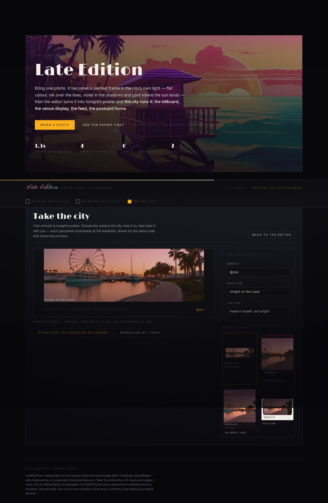

# LATE EDITION

**The city prints you. Then your poster takes the city.**

A GTA VI-inspired experience built for the
[Unlayer "Build with React Image Editor" Challenge](https://github.com/unlayer/react-image-editor).

You bring one photo. It does not leave your browser: **a segmentation model finds you in the frame**
(MediaPipe's `selfie_multiclass`, served from this site's own origin — no key, no account, no upload,
Apache-2.0), the press paints you in the city's light, and composites you **into a place** — a Bahía
beach at golden hour, the marina, a rooftop pool, a palm boulevard. Then the fork: **download the plate
raw**, or take it into the editor and make tonight's poster. And then the payoff: **the city runs it.**
Your artwork goes up on the roadside billboard, onto the venue's foyer display, into the coast's feed,
and home as a printed postcard. Every placement downloads at full resolution, and the plate itself
never carries text — only the placements do, as a separate download.

**React Image Editor is the workstation for every surface**, and each surface hands you a deliberately
different tool set — so "the editor is core" is structural, not a claim. The placements are the reason
to use it.

Nothing about your photo leaves the machine: the print desk runs on your own GPU. There is no account,
no API key, and no upload to anything of ours.



**No GPU? Take the tour:** `?demo=launch` opens the launch stage with a cast plate — the same
components and the same exporter the live path uses. `docs/DESIGN.md` is the design contract every
component answers to.

## The design language

The chrome is measured from the studio's own site rather than guessed at (tokens and CSS read from
`rockstargames.com/VI`):

| Token | Value | Where it came from |
|---|---|---|
| canvas | `#07070a`, panels `#0d0d12` / `#14141a` | their near-black chrome (`#000`, `#111117`, `#141414`, `#222`) |
| text | `#cecece` body, `#989898` muted, `#f2efe9` display | their text ramp (`#cecece`, `#989898`, `#ebebeb`) |
| accent | `#fcaf17` | their single warm brand gold |
| backdrops | 189° gradients — navy `#16203f→#0d0c1a`, plum `#2d1f36→#0f0c1a`, slate `#1f355b→#161733` | their deep-tone panel gradients |

Type is an Art Deco display face over a neo-grotesque, which is their structure (a deco display over
Helvetica Now). The open equivalents here are **Limelight** (display), **Poiret One** (kickers),
**Inter** (text) and **Pinyon Script** (the wordmark) — all OFL, all self-hosted in `public/fonts/`,
so nothing is fetched at runtime and no proprietary face is copied.

Motion is a library, not a hack: `motion` (Framer Motion) drives reveals, the hero sheen and the
ticker, and everything collapses under `prefers-reduced-motion`. `tests/e2e/shell.spec.ts` asserts the
tokens render, the fonts load, no request leaves the origin, and reduced motion is respected.

## Run it

```bash
npm install
bash tools/desk/desk.sh setup     # one-time: the venv ComfyUI runs in + the desk's own tools
bash tools/desk/desk.sh start     # print desk on :8188, app on :5178, waits for both to answer
bash tools/desk/desk.sh status    # ports, pids, model count, GPU
bash tools/desk/desk.sh stop      # stops both, and proves the ports are free
```

`npm run desk`, `npm run desk:status`, `npm run desk:stop` and `npm run desk:logs` wrap the same script.
The desk is ComfyUI (`COMFY_DIR`, default `~/comfy/ComfyUI`) running FLUX.2 [klein] 4B locally; the app
proxies to it through `/print-desk`, so the browser never talks cross-origin.

**The desk does not have to be on this machine.** `tools/desk/front.mjs` is one origin — `/print-desk`,
`/restore-desk`, `/health` — with CORS, the progress socket, and a ceiling of 12 prints an hour per
address. Put a tunnel in front of it and the deployed site prints for real:

```bash
bash tools/desk/tunnel.sh start    # free: a Cloudflare tunnel from this machine, prints the URL
#   → https://langersword.github.io/late-edition/?desk=<that url>   (remembered in localStorage)
bash tools/desk/aws.sh up          # or rent the GPU: g5.xlarge, ~$1.21/hr, stops itself when idle
```

`?desk=` is not a rebuild: the page resolves the desk at runtime, says in the intake where the photo is
going, and falls back to "no desk on this host" with the way in when nothing answers. Costs, quota and
the self-stop watchdog are written up in [`docs/print-desk.md`](docs/print-desk.md).

## The pipeline

```
browser: photo → segment ──► paint ──► place into a scene ──► THE FORK ──► editor ──► launch
                (MediaPipe)   (stylise)  (art/scenes/*.jpg)    raw │ edited
                                                                 │
desk:    photo → frame.py ──► print.mjs ──► plate ──► editor ──► launch
        face detect    look spec      |         React       billboard · venue
        + crop         + klein        |         Image       feed · postcard
                                      |         Editor      (canvas export)
                                      └─ harness.mjs: best-of-N, gated and judged
```

The launch stage is data, not markup: `src/world/placements.ts` holds each surface as numbers
(canvas size, artwork rect, ground, text layers with their fonts and limits), and
`src/world/compose.ts` draws them. The preview and the download call the same `drawPlacement()`, so
the thing on screen *is* the file — a preview built from CSS would be a second implementation of the
same spec, and the two would drift the first time a number moved. `tests/unit/placements.test.ts`
checks the specs before anything is drawn (no layer leaves the canvas, every layer carrying user copy
is width-limited, the night surfaces keep a scrim that closes dark), and `tests/e2e/launch.spec.ts`
asserts a downloaded postcard is a real 1500×1000 PNG at three viewports with no horizontal overflow
and no console errors.

The night surfaces sit on **the city's own plates** — `public/art/city/`, three 1344×768 scenery
frames printed by `npm run scenery` (`tools/print-desk/scenery.mjs`) from the look spec's scenery,
lighting and palette clauses, with the person deliberately left out. A face detector is run over the
result before it ships: scenery only, no cast, nothing borrowed.

- **`tools/print-desk/frame.py`** — finds the face (frontal → alt → profile) and crops to a
  head-and-shoulders frame before the model sees anything. A face filling 4% of a landscape photo
  prints as mush; framed, it prints as a portrait. Every crop decision is reported as JSON.
- **`src/look/look.json`** — the look spec, and the single source of truth for how anything here
  looks: registers (character shot, key art, press photo, neon night), lighting presets, palettes,
  identity rules and the compliance floor. Prompts are *compiled* from it by `src/look/compile.mjs`,
  never written by hand, and a test enforces that every compiled prompt stays inside the budget a 4B
  distilled model actually reads.
- **`tools/print-desk/print.mjs`** — one plate: compile → upload → sample → restore the face from the
  photo (`facefix.py`: eye-aligned, full-resolution, colour-clamped, alpha-blended over a graded plate)
  → write with provenance (register, location, seed, spec version in the filename).
  `--hq` is the quality preset: the base model at 26 steps, guidance 1.0, on a **1280** canvas, with an
  **identity floor of 0.45** — a plate that does not clear it is reprinted with a new seed rather than
  shipped. Quality mode means a plate that passes, not a plate that took longer.
- **`tools/print-desk/identity.py`** — ArcFace identity and landmark geometry against the photo.
  Calibrated on this pipeline: the raw model output measures **0.083** cosine (a different person), the
  face-restored plate **0.93–0.95**. This is the harness's strictest gate.
- **`tools/desk/restore.mjs`** — the finishing service (`POST /prepare`, `POST /restore`, port 8788,
  proxied as `/restore-desk`). Framing and face restore are Python; without this the *app* printed raw
  model output (identity 0.08) while the CLI printed 0.93. Same pipeline, two different products — the
  service is what closed that gap. It is optional: if it is not running the app still prints, just
  without the restore.
- **`tools/print-desk/harness.mjs`** — quality harness: print a batch, gate it numerically
  (`critique.py`), judge it with a local vision model (`judge.py` — Qwen2.5-VL in 4-bit, scoring
  identity, lighting, colour, background, composition and artifacts against your reference photo),
  measure identity with `identity.py`, and rank **identity first**, then the judge, then the gate.
  Locations rotate across candidates so a batch shows the city, not one street.
- **`tools/desk/desk.sh`** — start/stop/status/warm for the whole stack.

Generated plates, framed references and comparison sheets land in `print-desk-out/` (gitignored):
`plates/` for finished work, `harness/` for batches, `compare/` for side-by-sides, `refs/` for crops.

## What you choose in the app

| Choice | Options | What it does |
|---|---|---|
| Style | Character shot · Loading screen · Poster · Press photo | Picks the register — a photoreal character portrait, a painted loading-screen panel with a clear band for your name, a night poster, or a tabloid photo |
| Location | Rotate (7 places) · Palm boulevard · Marina pier · Downtown canyon · Rooftop · Night market · Seafront road · Hillside overlook | Where the subject stands; "rotate" lets the desk choose per print so you never get the same street twice |
| Quality print | off / on | Base model at 26 steps instead of the fast 4-step distilled one — slower, sharper, better light |

Every option is read from `src/look/look.json`, so the UI and the desk can never disagree about what
a "location" or a "style" is.

## How the editor is used

React Image Editor (`@unlayer/react-image-editor`) is the only thing the player *produces* with. Its
tools are load-bearing per surface: each surface ships a different `features.imageEditor.tools` map,
the saved pixels are what the game grades, and the brief changes what a good result even means.

## Status

**In active development.** This repository is private while it is being built and goes public before
submission. Working end to end today: intake with face framing, the local print desk, live in-app
printing with real progress, and the editor mounting on surface 1. Still being built: the grading
engine, and surfaces 2–4.

---

Unofficial fan-made project for the Unlayer Build with React Image Editor Challenge.
Not affiliated with, endorsed by, or connected to Rockstar Games or Take-Two Interactive.
All visuals are original work; the city (Bahía Rosa) and its newspaper (LA GAVIOTA) are invented.
